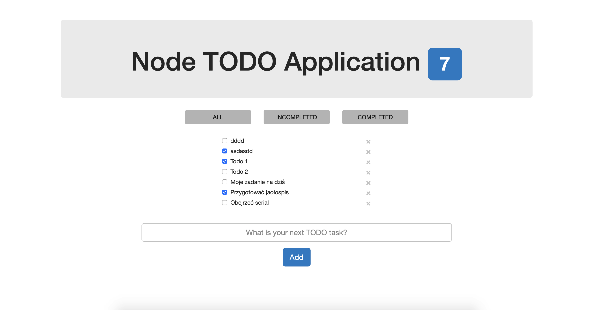

# node-todo-application
A simple TODO task management application made with [Node.js](https://nodejs.org/en/), [Angular.js](https://angularjs.org) and [MongoDB](https://www.mongodb.com).

### How to test?

1. To run the application you should have Node.js installed with some additional modules such as body-parser, cors, mongodb, path etc.  Use ```sudo npm install <module>``` command in the project directory.

2. Initialize application server with ```node server.js``` command in the project directory.

3. Test the app at [localhost:4000](http://localhost:4000).

### Screens


